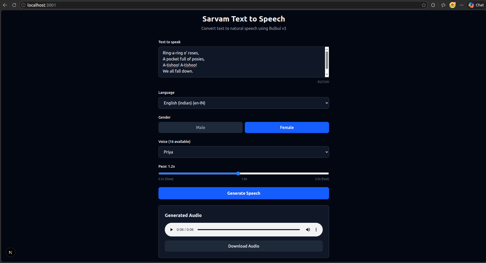

# Sarvam AI - Text to Speech

A Next.js application that converts text to natural speech using [Sarvam AI's](https://sarvam.ai) Bulbul v3 Text-to-Speech API, supporting 11 Indian languages and 30+ speaker voices.



## Features

- **11 Indian Languages** — Hindi, Bengali, Tamil, Telugu, Gujarati, Kannada, Malayalam, Marathi, Punjabi, Odia, and English (Indian accent)
- **30+ Speaker Voices** — Male and female voices with distinct tones
- **Pace Control** — Adjust speech speed from 0.5x to 2.0x
- **Audio Playback** — Listen to generated speech directly in the browser
- **Download** — Save generated audio as WAV files

## Getting Started

### Prerequisites

- Node.js 18+
- A [Sarvam AI](https://dashboard.sarvam.ai) API key

### Setup

1. Clone the repository:
   ```bash
   git clone git@github.com:esakkiraja100116/sarvam-ai.git
   cd sarvam-ai
   ```

2. Install dependencies:
   ```bash
   npm install
   ```

3. Create a `.env` file in the root directory:
   ```
   SARVAM_API_KEY=your_api_key_here
   ```

4. Start the development server:
   ```bash
   npm run dev
   ```

5. Open [http://localhost:3000](http://localhost:3000) in your browser.

## Tech Stack

- **Next.js 16** with App Router and Turbopack
- **TypeScript**
- **Tailwind CSS v4**
- **Sarvam AI Bulbul v3** TTS API
